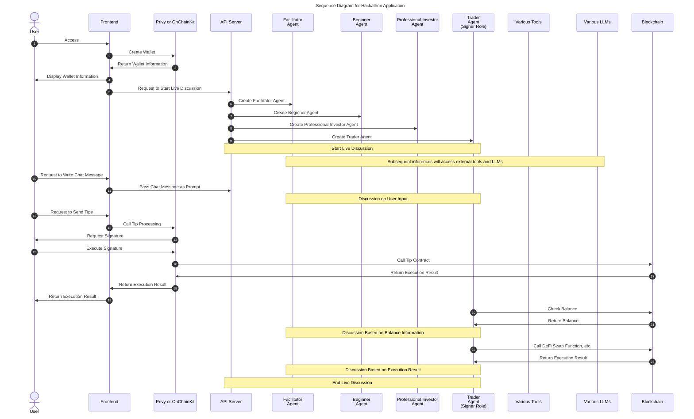

# Sequence

```mermaid
sequenceDiagram
    title: Sequence Diagram for Hackathon Application
    autonumber
    actor user as User
    participant frontend as Frontend
    participant userWallet as Privy or OnChainKit
    participant api as API Server
    participant agent1 as Facilitator<br/>Agent
    participant agent2 as Beginner<br/>Agent
    participant agent3 as Professional Investor<br/>Agent
    participant agent4 as Trader<br/>Agent<br/>(Signer Role)
    participant tools as Various Tools
    participant llm as Various LLMs
    participant blockchain as Blockchain
    user ->> frontend: Access
    frontend ->> userWallet: Create Wallet
    userWallet ->> frontend: Return Wallet Information
    frontend ->> user: Display Wallet Information
    frontend ->> api: Request to Start Live Discussion
    api ->> agent1: Create Facilitator Agent
    api ->> agent2: Create Beginner Agent
    api ->> agent3: Create Professional Investor Agent
    api ->> agent4: Create Trader Agent
    note over api, agent4: Start Live Discussion
    note over agent1, llm: Subsequent inferences will access external tools and LLMs
    user ->> frontend: Request to Write Chat Message
    frontend ->> api: Pass Chat Message as Prompt
    note over agent1, agent4: Discussion on User Input
    user ->> frontend: Request to Send Tips
    frontend ->> userWallet: Call Tip Processing
    userWallet ->> user: Request Signature
    user ->> userWallet: Execute Signature
    userWallet ->> blockchain: Call Tip Contract
    blockchain ->> userWallet: Return Execution Result
    userWallet ->> frontend: Return Execution Result
    frontend ->> user: Return Execution Result
    agent4 ->> blockchain: Check Balance
    blockchain ->> agent4: Return Balance
    note over agent1, agent4: Discussion Based on Balance Information
    agent4 ->> blockchain: Call DeFi Swap Function, etc.
    blockchain ->> agent4: Return Execution Result
    note over agent1, agent4: Discussion Based on Execution Result
    note over api, agent4: End Live Discussion
```
